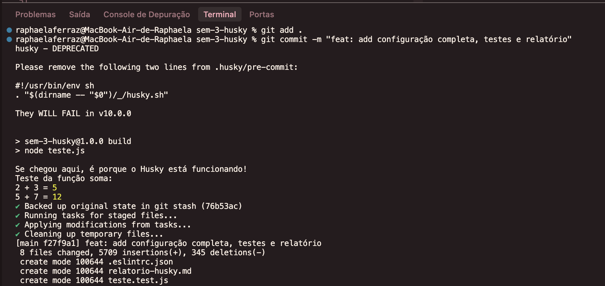
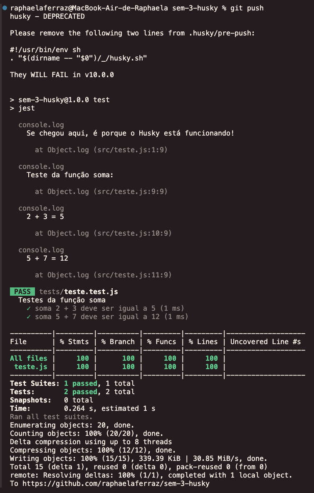

 # Projeto com Husky

Este projeto demonstra a implementação do Husky em um repositório GitHub, utilizando hooks pré-commit e pré-push para garantir a qualidade do código.

## Estrutura do Projeto

```
.
├── src/           # Código fonte
├── tests/         # Testes
├── docs/          # Documentação
├── .husky/        # Configurações do Husky
└── package.json   # Configurações do projeto
```

## Funcionalidades

- Hooks pré-commit e pré-push configurados
- Verificação automática de qualidade de código
- Execução automática de testes
- Compilação automática

## Pré-requisitos

- Node.js
- npm
- Git

## Instalação

1. Instale as dependências:

```bash
npm install
```

2. Configure o Husky:

```bash
npm run prepare
```

## Executando os testes

Para executar os testes manualmente:

```bash
npm test
```

## Configuração do Husky

### Hook Pré-commit

O hook pré-commit executa:

- Compilação do código
- Verificação com ESLint
- Testes relacionados aos arquivos modificados

### Hook Pré-push

O hook pré-push executa:

- Todos os testes do projeto
- Garantia de que nenhum teste falhe antes do push

## Estrutura do Projeto

- `teste.js`: Arquivo principal com a função de exemplo
- `teste.test.js`: Arquivos de teste usando Jest
- `.husky/`: Diretório com as configurações dos hooks
- `package.json`: Configurações do projeto e dependências

## Evidências de Funcionamento

### Pré-commit



Na imagem acima, é possível observar que o Husky está funcionando devido à mensagem "Se chegou aqui, é porque o Husky está funcionando!" que é exibida no terminal, além do teste da função soma(2, 3) que retorna 5 e soma(5, 7) que retorna 12.

### Pré-push



Na imagem acima, é possível observar que o Husky está funcionando devido às mensagens de sucesso que são exibidas, além de todos os testes passarem.


## Conclusão

A configuração do Husky foi realizada com sucesso, garantindo a qualidade do código através de:

- Compilação automática
- Execução de testes
- Verificação de boas práticas de codificação